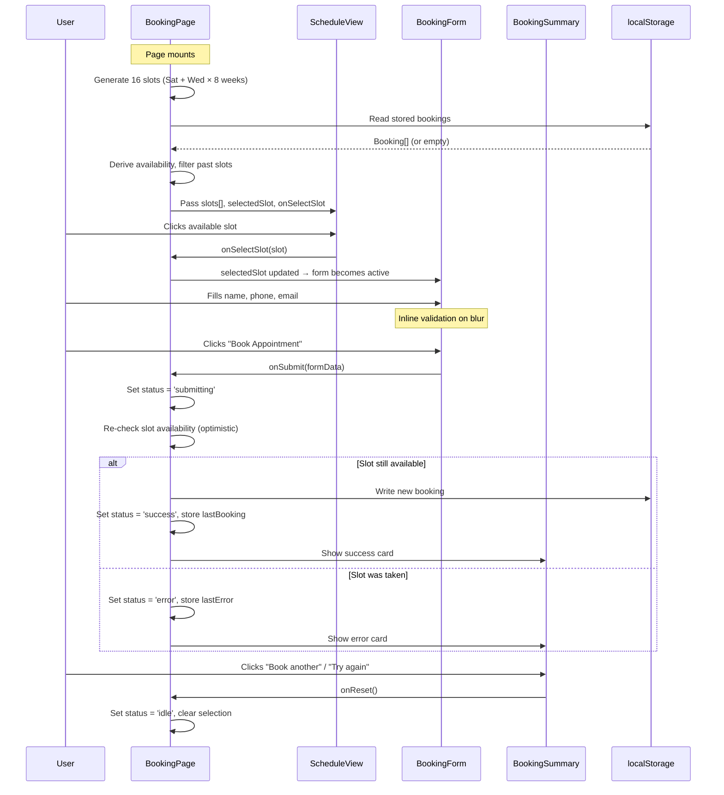

# UI Contracts: Appointment Booking

**Feature**: `002-appointment-booking` | **Phase**: 1 — Design | **Spec**: [spec.md](../spec.md)

> [!NOTE]
> This document defines the component interfaces, prop contracts, visual states, and event flows for the `/book` route. All components consume design tokens from [tokens.css](file:///D:/vabi%20voding/docter%20web/src/styles/tokens.css), bilingual strings from [LangContext](file:///D:/vabi%20voding/docter%20web/src/contexts/LangContext.jsx), and validation logic from [validation.js](file:///D:/vabi%20voding/docter%20web/src/utils/validation.js).

---

## Page Component

### BookingPage (`src/pages/BookingPage.jsx`)

| Property | Value |
|----------|-------|
| **Route** | `/book` |
| **Parent** | `App` (rendered via React Router) |
| **Contexts consumed** | `LangContext` (lang, t, toggle), `ThemeContext` |

**Layout**:
- Full-width page wrapper with `min-h-screen`, `bg-surface`, `text-on-surface`
- **Header area**: bilingual page title (`<h1>`) + back link (`←` / `→` depending on `dir`) to landing page (`/`)
- **Two-column grid** on desktop (`md:` breakpoint and above): ScheduleView on the inline-start side, BookingForm on the inline-end side
- **Single column stack** on mobile (`< md`): ScheduleView stacks above BookingForm
- BookingSummary replaces the form area conditionally after submission

**State management**:

```js
const [selectedSlot, setSelectedSlot] = useState(null);       // TimeSlot | null
const [bookings, setBookings] = useState([]);                  // Booking[]
const [bookingStatus, setBookingStatus] = useState('idle');    // 'idle' | 'submitting' | 'success' | 'error'
const [lastBooking, setLastBooking] = useState(null);          // Booking | null (most recent)
const [lastError, setLastError] = useState(null);              // string | null
```

**Responsibilities**:
1. Generate the next 16 upcoming slots (8 weeks × Sat + Wed at 4:00 PM) based on `new Date()`
2. Read existing bookings from `localStorage` on mount (`useEffect`)
3. Write updated bookings to `localStorage` after each successful submission
4. Derive slot availability by cross-referencing generated slots against stored bookings
5. Filter out past slots before passing to ScheduleView
6. Provide `onSelectSlot`, `onSubmit`, and `onReset` callbacks to children
7. Handle the `bookingStatus` state machine transitions

**SEO**:
- Bilingual `<title>` via `document.title` or `<Helmet>` equivalent (e.g. `t.booking.pageTitle`)
- `<meta name="description">` with bilingual content (`t.booking.metaDescription`)

---

## Components

### ScheduleView (`src/components/booking/ScheduleView.jsx`)

**Props**:

| Prop | Type | Required | Description |
|------|------|----------|-------------|
| `slots` | `TimeSlot[]` | ✅ | Pre-filtered array of upcoming slots (past slots excluded) |
| `selectedSlot` | `TimeSlot \| null` | ✅ | Currently selected slot, or `null` if none selected |
| `onSelectSlot` | `(slot: TimeSlot) => void` | ✅ | Callback fired when user clicks an available slot |

**Renders**: A responsive grid of slot cards — up to 16 cards maximum.

**Slot card content** (each card):
- **Date**: `DD/MM/YYYY` format (language-neutral per FR-017)
- **Day label**: Localized day name — `t.booking.saturday` / `t.booking.wednesday` (e.g., "السبت" / "Saturday")
- **Time**: `4:00 PM` (fixed, displayed in locale-appropriate format)
- **Availability badge**: visual indicator of slot state

**Visual states per slot**:

| State | Condition | Appearance | Interaction |
|-------|-----------|------------|-------------|
| **Available** | Not booked, not selected | `bg-surface-container-low`, `border border-outline-variant`, `text-on-surface` | Clickable. On hover: `border-primary`, subtle `scale-[1.02]` via Framer Motion |
| **Selected** | `selectedSlot.date === slot.date` | `bg-primary`, `text-on-primary`, `scale-[1.02]`, `shadow-md` | Clickable (to deselect/reselect). Visually elevated |
| **Booked** | Slot date exists in `bookings[]` | `bg-surface-dim`, `text-on-surface-variant`, `opacity-60` | **Not clickable** (`pointer-events-none`). Shows "Booked" / "محجوز" badge or strikethrough on time |
| **Past** | `slot.date < now` | _Not rendered_ | Filtered out by BookingPage before passing `slots` prop |

**Responsive grid**:
- Mobile (`< sm`): `grid-cols-2`
- Tablet (`sm` – `lg`): `grid-cols-3`
- Desktop (`≥ lg`): `grid-cols-4`

**Animations** (Framer Motion):
- **Mount**: staggered `fadeInUp` — each card delays by `index * 0.05s`, `opacity: 0 → 1`, `y: 20 → 0`
- **Hover** (available slots only): `whileHover={{ scale: 1.02 }}` with `transition={{ type: "spring", stiffness: 300 }}`
- **Selection**: `layoutId` or `animate` to smoothly transition background/border on select

**Accessibility**:
- Container: `role="radiogroup"`, `aria-label={t.booking.selectSlotLabel}`
- Each slot card: `role="radio"`, `aria-checked={isSelected}`, `aria-disabled={isBooked}`, `tabIndex={isBooked ? -1 : 0}`
- Keyboard: `Enter` / `Space` to select, arrow keys to navigate between slots
- Screen reader: each card announces date, day, time, and availability status

---

### BookingForm (`src/components/booking/BookingForm.jsx`)

**Props**:

| Prop | Type | Required | Description |
|------|------|----------|-------------|
| `selectedSlot` | `TimeSlot \| null` | ✅ | The slot the user selected, or `null` |
| `onSubmit` | `(formData: BookingFormData) => void` | ✅ | Callback fired with validated form data |
| `isSubmitting` | `boolean` | ✅ | `true` while BookingPage is processing the submission |
| `disabled` | `boolean` | ✅ | `true` when all slots are booked (form entirely disabled) |

**Fields**:

| Field | Input type | Attributes | Validation | i18n keys |
|-------|-----------|------------|------------|-----------|
| Patient name | `<input type="text">` | `required`, `autoComplete="name"` | `validateName()` — min 2 chars, non-empty | `t.booking.nameLabel`, `t.booking.namePlaceholder`, `t.booking.nameError` |
| Phone number | `<input type="tel">` | `required`, `dir="ltr"`, `autoComplete="tel"` | `validatePhone()` — Egyptian mobile format `01[0125]XXXXXXXX` | `t.booking.phoneLabel`, `t.booking.phonePlaceholder`, `t.booking.phoneError` |
| Email address | `<input type="email">` | `required`, `dir="ltr"`, `autoComplete="email"` | `validateEmail()` — standard `user@domain.tld` format | `t.booking.emailLabel`, `t.booking.emailPlaceholder`, `t.booking.emailError` |

> [!IMPORTANT]
> The spec (FR-003, FR-005) requires email as a **required** field for the booking page, even though the existing `validateEmail()` in `validation.js` treats it as optional. The booking form must enforce a non-empty email and show an error when blank. Either extend `validateEmail` with a `required` parameter or add a separate `validateEmailRequired()` function.

**Selected slot display**:
- When `selectedSlot` is not null: render a chip/badge above the form fields showing the selected date, day, and time
- Chip uses `bg-primary-container`, `text-on-primary-container`, `rounded-full`, `px-4 py-1`
- Includes a small `✕` button to deselect (fires `onSelectSlot(null)` via parent callback)

**Validation behavior**:
- **On blur**: validate the individual field, show inline error if invalid
- **On submit**: validate all fields, show all errors simultaneously, prevent submission if any field is invalid
- Error messages render below each field in `text-error` with `text-sm`
- Each error element has `id="fieldName-error"` and the input has `aria-describedby="fieldName-error"`

**Submit button**:
- Text: `t.booking.submitButton` (e.g., "Book Appointment" / "احجز موعد")
- `bg-primary`, `text-on-primary`, `rounded-lg`, `px-6 py-3`, `font-semibold`
- **Disabled states** (any of these → button is `disabled`, `opacity-50`, `cursor-not-allowed`):
  1. No slot selected (`selectedSlot === null`)
  2. Submission in progress (`isSubmitting === true`)
  3. All slots booked (`disabled === true`)
- While submitting: show a loading spinner inline and change text to `t.booking.submittingButton`

**Animations** (Framer Motion):
- **Form entrance**: `animate={{ opacity: 1, y: 0 }}` from `initial={{ opacity: 0, y: 16 }}`
- **Error shake**: on invalid submit, the form container plays `x: [0, -8, 8, -8, 8, 0]` over 400ms
- **Field error**: error text fades in with `AnimatePresence` + `motion.p`

**Accessibility**:
- All `<label>` elements use `htmlFor` matching input `id`
- All inputs have `aria-required="true"`
- Invalid inputs have `aria-invalid="true"` and `aria-describedby` pointing to their error message
- Submit button has `aria-disabled` matching its disabled state
- Form uses `<form>` element with `onSubmit` handler (not click-on-button)

---

### BookingSummary (`src/components/booking/BookingSummary.jsx`)

**Props**:

| Prop | Type | Required | Description |
|------|------|----------|-------------|
| `booking` | `Booking \| null` | ✅ | The successfully created booking, or `null` on error |
| `error` | `string \| null` | ✅ | Error message key/string, or `null` on success |
| `onReset` | `() => void` | ✅ | Callback to reset to slot selection (clears status) |

**Success state** (when `booking !== null && error === null`):

| Element | Details |
|---------|---------|
| Checkmark icon | `material-symbols-outlined` `check_circle`, `text-primary`, `text-5xl`, Framer Motion bounce animation (`scale: [0, 1.2, 1]`, `duration: 0.5s`) |
| Title | `t.booking.confirmationTitle` — e.g., "Appointment Confirmed!" / "!تم تأكيد الموعد" |
| Details card | `bg-surface-container`, `rounded-xl`, `p-6`, `shadow-sm`. Rows: Date, Time, Name, Phone, Email — each with label + value |
| "Book another" button | `bg-secondary`, `text-on-secondary`, `rounded-lg`. Fires `onReset()` |
| Cancellation note | `text-on-surface-variant`, `text-sm`. Includes bilingual text directing patient to WhatsApp for cancellation. WhatsApp link opens `https://wa.me/CLINIC_NUMBER` |

**Error state** (when `error !== null`):

| Element | Details |
|---------|---------|
| Warning icon | `material-symbols-outlined` `warning`, `text-error`, `text-5xl` |
| Error title | `t.booking.errorTitle` — e.g., "Booking Failed" / "فشل الحجز" |
| Error message | `text-on-error-container` on `bg-error-container`, `rounded-lg`, `p-4`. Displays the localized error string |
| "Try again" button | `bg-primary`, `text-on-primary`, `rounded-lg`. Fires `onReset()` |

**Animations** (Framer Motion):
- `AnimatePresence` wraps the entire summary for enter/exit transitions
- **Enter**: `opacity: 0 → 1`, `scale: 0.95 → 1`, `duration: 0.3s`
- **Exit**: `opacity: 1 → 0`, `scale: 1 → 0.95`, `duration: 0.2s`

**Accessibility**:
- Success card: `role="status"`, `aria-live="polite"` — announced by screen reader on appearance
- Error card: `role="alert"`, `aria-live="assertive"`
- "Book another" / "Try again" buttons: clear `aria-label` with bilingual text

---

## Component Hierarchy

```text
BookingPage
├── PageHeader (title + back link)
├── ScheduleView
│   └── SlotCard (×16 max)
├── BookingForm
│   ├── SelectedSlotChip
│   ├── NameInput
│   ├── PhoneInput
│   ├── EmailInput
│   └── SubmitButton
└── BookingSummary (conditional: shown after submit)
    ├── SuccessCard
    └── ErrorCard
```

**Conditional rendering logic in BookingPage**:

```jsx
{bookingStatus === 'idle' || bookingStatus === 'submitting' ? (
  <>
    <ScheduleView
      slots={availableSlots}
      selectedSlot={selectedSlot}
      onSelectSlot={setSelectedSlot}
    />
    <BookingForm
      selectedSlot={selectedSlot}
      onSubmit={handleSubmit}
      isSubmitting={bookingStatus === 'submitting'}
      disabled={allSlotsBooked}
    />
  </>
) : (
  <BookingSummary
    booking={lastBooking}
    error={lastError}
    onReset={handleReset}
  />
)}
```

---

## Shared Contracts

### TimeSlot (shape — not a runtime type)

```js
{
  id: string,           // ISO date string, e.g. "2026-07-19T16:00:00"
  date: Date,           // JavaScript Date object for the slot
  dayOfWeek: string,    // "saturday" | "wednesday" (internal key, not displayed)
  formattedDate: string, // "19/07/2026" (DD/MM/YYYY, pre-formatted)
  formattedTime: string, // "4:00 PM"
  isBooked: boolean     // Derived from bookings array
}
```

### BookingFormData (internal type)

```js
{
  patientName: string,    // Validated: ≥ 2 chars, trimmed
  patientPhone: string,   // Validated: Egyptian mobile format
  patientEmail: string    // Validated: standard email format, required
}
```

### Booking (persisted to localStorage)

```js
{
  id: string,             // UUID or timestamp-based unique ID
  slotId: string,         // Matches TimeSlot.id
  patientName: string,
  patientPhone: string,
  patientEmail: string,
  slotDate: string,       // ISO date string
  createdAt: string       // ISO timestamp of when booking was created
}
```

---

## Event Flow



### Step-by-step flow:

1. **Page loads** → BookingPage generates 16 slots → reads `localStorage` for existing bookings → derives availability → renders ScheduleView + BookingForm
2. **User clicks slot** → `onSelectSlot` fires → `selectedSlot` state updates → BookingForm becomes active (submit button no longer disabled due to missing slot)
3. **User fills form** → client-side validation runs on each field's `blur` event via `validateName()`, `validatePhone()`, `validateEmail()`
4. **User clicks submit** → `onSubmit` fires → BookingPage sets `bookingStatus = 'submitting'` → re-checks that `selectedSlot` is not already in `bookings[]`
5. **Success path** → writes `Booking` to `localStorage` → sets `bookingStatus = 'success'` → renders BookingSummary with confirmation details
6. **Error path** → sets `bookingStatus = 'error'` → renders BookingSummary with error message → user clicks "Try again" → `onReset()` fires → resets to `bookingStatus = 'idle'`, clears `selectedSlot`

---

## Routing Integration

> [!IMPORTANT]
> The current `App.jsx` has no router — it renders all sections inline. Adding the `/book` route requires introducing `react-router-dom` and wrapping the app in a `<BrowserRouter>`. The landing page content moves into a `LandingPage` component rendered at `/`, while `BookingPage` renders at `/book`.

**Required changes to `App.jsx`**:

```diff
+import { BrowserRouter, Routes, Route } from 'react-router-dom';
+import BookingPage from './pages/BookingPage';

-function MainAppContent() {
-  return (
-    <div>
-      <Navbar />
-      <main>
-        <HeroSection />
-        ...all sections...
-      </main>
-      <Footer />
-    </div>
-  );
-}

+function LandingPage() {
+  return (
+    <div>
+      <Navbar />
+      <main>
+        <HeroSection />
+        ...all sections...
+      </main>
+      <Footer />
+      <WhatsAppFloat />
+    </div>
+  );
+}

 export default function App() {
   return (
     <ThemeProvider>
       <LangProvider>
-        <MainAppContent />
+        <BrowserRouter>
+          <Routes>
+            <Route path="/" element={<LandingPage />} />
+            <Route path="/book" element={<BookingPage />} />
+          </Routes>
+        </BrowserRouter>
       </LangProvider>
     </ThemeProvider>
   );
 }
```

---

## Design Token Usage Map

| Token | Where used |
|-------|-----------|
| `--primary` / `--on-primary` | Selected slot card, submit button, checkmark icon |
| `--primary-container` / `--on-primary-container` | Selected slot chip in BookingForm |
| `--secondary` / `--on-secondary` | "Book another" button |
| `--surface` / `--on-surface` | Page background, default text |
| `--surface-container-low` | Available slot card background |
| `--surface-container` | Confirmation details card |
| `--surface-dim` | Booked slot card background |
| `--on-surface-variant` | Booked slot text, cancellation note |
| `--outline-variant` | Available slot border |
| `--error` / `--on-error` | Validation errors, error state icon |
| `--error-container` / `--on-error-container` | Error message card |

---

## i18n Keys Required

The following keys must be added to `src/i18n/ar.js` and `src/i18n/en.js` under a `booking` namespace:

```js
booking: {
  pageTitle,            // "Book an Appointment" / "احجز موعد"
  metaDescription,      // SEO meta description
  backToHome,           // "Back to Home" / "العودة للرئيسية"
  selectSlotLabel,      // "Select an appointment time" / "اختر وقت الموعد"
  saturday,             // "Saturday" / "السبت"
  wednesday,            // "Wednesday" / "الأربعاء"
  booked,               // "Booked" / "محجوز"
  nameLabel,            // "Full Name" / "الاسم الكامل"
  namePlaceholder,      // "Enter your name" / "أدخل اسمك"
  nameError,            // "Name must be at least 2 characters" / "..."
  phoneLabel,           // "Phone Number" / "رقم الهاتف"
  phonePlaceholder,     // "01XXXXXXXXX"
  phoneError,           // "Enter a valid Egyptian mobile number" / "..."
  emailLabel,           // "Email Address" / "البريد الإلكتروني"
  emailPlaceholder,     // "you@example.com"
  emailError,           // "Enter a valid email address" / "..."
  submitButton,         // "Book Appointment" / "احجز موعد"
  submittingButton,     // "Booking..." / "...جاري الحجز"
  confirmationTitle,    // "Appointment Confirmed!" / "!تم تأكيد الموعد"
  errorTitle,           // "Booking Failed" / "فشل الحجز"
  slotTakenError,       // "This slot is no longer available..." / "..."
  bookAnother,          // "Book Another Appointment" / "احجز موعد آخر"
  tryAgain,             // "Try Again" / "حاول مرة أخرى"
  cancellationNote,     // "To cancel or modify..." / "...للإلغاء أو التعديل"
  noSlotsAvailable,     // "No appointments available..." / "..."
  localTimeNote,        // "Times shown are based on your device clock" / "..."
  storageError,         // "Unable to save bookings..." / "..."
}
```
